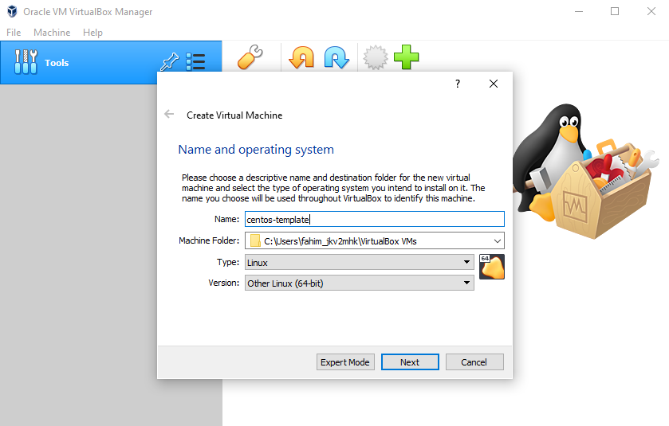
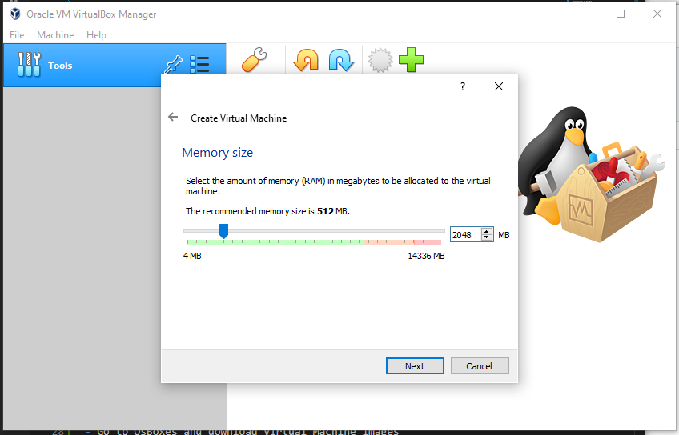

## Ansible
- This repository will introduce Ansible for beginners!

### Objectives 

- Introduction to Ansible
- Setting up Ansible on VirtualBox
- Introduction to YAML
- Inventory Files
- Playbooks
- Variables
- Conditionals 
- Loops
- Roles

### What is Ansible?

- Ansible is a powerful IT automation tool that can be learned quickly
- Simple, Powerful, Agentless
- Use case example - Imagine having multiple servers and wanting to run updates or turn them off. Instead of having to manually entering these servers to perform actions, this can easily be done by using a playbook 
- Another example - Imagine setting up a complex infrastructure 100s of VMs consisting of public and private clouds. With Ansible, it is possible to provision public clouds on AWS etc. And then configurating them 

### Setting up Ansible

- Install Oracle VirtualBox https://www.virtualbox.org/wiki/Downloads
- Open VirtualBox
- Now to deploy Virtual Machines
- Go to OsBoxes and download Virtual Machine images
- On VirtualBox click on New > Enter Name and Operating System

- Will now be prompted to creating a new virtual hard disk
- Select "Use an existing virtual hard disk file" and browse for your download Virtual Machine Image
- Now go to settings > system > processor > 2 CPUs
- Then go to network > adapter 1 > attached to : Bridged Adapter (This gives the virtual machine an IP address and access to the internet)
- Now we can run the system 